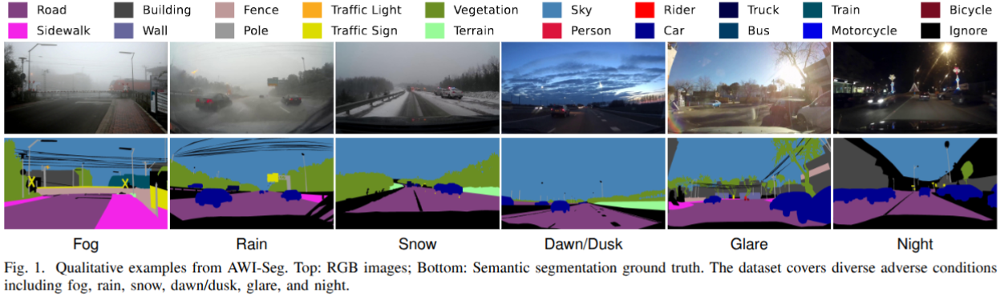

# AWI-Seg: A Unified Benchmark for Semantic Segmentation under Adverse Weather and Illumination Driving Scenarios

## Abstract

Semantic segmentation under adverse weather and illumination conditions remains a critical challenge for real-world autonomous driving, due to severe appearance degradation and large domain shifts. However, existing benchmarks and adaptation methods offer limited insight into model robustness under such extreme conditions. In this work, we introduce AWI-Seg, a large-scale dataset and unified benchmark that consolidates diverse adverse weather and illumination scenarios into a consistent semantic space, enabling systematic evaluation of segmentation models under challenging driving environments.

Based on empirical observations from this benchmark, we further propose a two-stage Generalize-then-Adapt (GtA) training framework built upon vision foundation models. GtA explicitly organizes supervised domain generalization and unsupervised domain adaptation into a sequential training paradigm, providing a more reliable initialization for adaptation and improving training stability under severe domain shifts. To support effective adaptation of frozen backbones for dense prediction, we design an adapter-based module that integrates token-based feature refinement with spatial prior injection and multi-scale interaction.

Extensive experiments on AWI-Seg and multiple real-world benchmarks demonstrate that the proposed benchmark exposes clear limitations of existing approaches, and that GtA consistently outperforms state-of-the-art domain generalization and adaptation methods. Together, our dataset and training framework establish a strong and practical reference for robust semantic segmentation under adverse weather and illumination conditions.

## Examples

Qualitative examples from AWI-Seg. **Top**: RGB images; **Bottom**: Semantic segmentation ground truth. The dataset covers diverse adverse conditions including fog, rain, snow, dawn/dusk, glare, and night.

