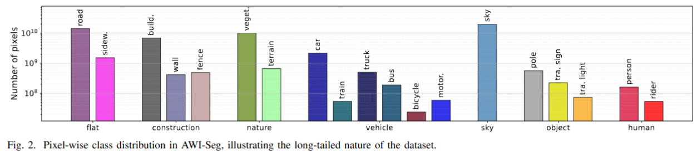

# AWI-Seg: A Unified Benchmark for Semantic Segmentation under Adverse Weather and Illumination Driving Scenarios

## Abstract

Semantic segmentation under adverse weather and illumination conditions remains a critical challenge for real-world autonomous driving, due to severe appearance degradation and large domain shifts. However, existing benchmarks and adaptation methods offer limited insight into model robustness under such extreme conditions. In this work, we introduce AWI-Seg, a large-scale dataset and unified benchmark that consolidates diverse adverse weather and illumination scenarios into a consistent semantic space, enabling systematic evaluation of segmentation models under challenging driving environments.

## Examples

Qualitative examples from AWI-Seg. **Top**: RGB images; **Bottom**: Semantic segmentation ground truth. The dataset covers diverse adverse conditions including fog, rain, snow, dawn/dusk, glare, and night.

Pixel-wise class distribution in AWI-Seg, illustrating the long-tailed nature of the dataset.

